# Birdie — Architecture Documentation

## 1. System Overview

Birdie is a cozy desktop companion game built in Unity 6. The game runs as a transparent overlay just above the Windows taskbar. The architecture follows a **Manager-centric pattern**: a singleton `GameManager` orchestrates all subsystems, each of which is a self-contained `BaseManager` subclass.

```mermaid
graph TB
    subgraph "Unity Runtime"
        GM["🎮 GameManager\n(Singleton Orchestrator)"]
    end

    subgraph "Core Systems"
        BM["BirdManager\nSpawning & Lifecycle"]
        EM["EconomyManager\nGolden Seeds"]
        FM["FriendshipManager\nPer-bird Relationship"]
        ENV["EnvironmentManager\nInteractive Objects"]
        SM["SoundManager\nAudio Channels"]
    end

    subgraph "Content Systems"
        DM["DiaryManager\nBird Discoveries"]
        STM["StoreManager\nShop & Purchases"]
        WM["WindowsillManager\nHabitat Items"]
        DMM["DailyMissionManager\nQuests"]
    end

    subgraph "UI Systems"
        MM["MenuManager\nMenu Routing"]
        DUI["DiaryUIManager\nDiary View"]
        TM["ToastManager\nNotifications"]
        LM["LoadingManager\nLoading Screen"]
        HGC["HideGameController\nOverlay Visibility"]
    end

    subgraph "Persistence"
        SVM["SaveManager\nJSON + Backup"]
        SD["SaveData\nMaster Container"]
    end

    subgraph "Data"
        BD["BirdData\nScriptableObjects"]
        SL["SoundLibrary\nScriptableObject"]
        SID["StoreItemData\nScriptableObjects"]
    end

    GM --> BM & EM & FM & ENV & SM
    GM --> DM & STM & WM & DMM
    GM --> MM & DUI & TM & LM & HGC
    GM --> SVM

    SVM --> SD
    BM --> BD
    SM --> SL
    STM --> SID
```

---

## 2. Initialization Pipeline

The game uses a **phased async initialization** via UniTask. Each phase must complete before the next starts. Within a phase, independent managers initialize in parallel.

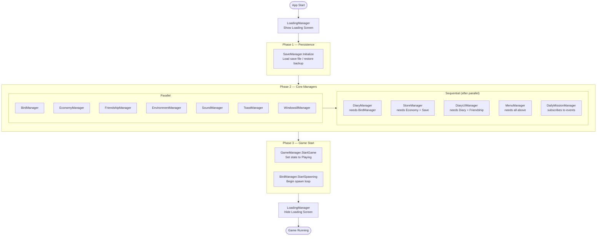

---

## 3. Manager Class Hierarchy

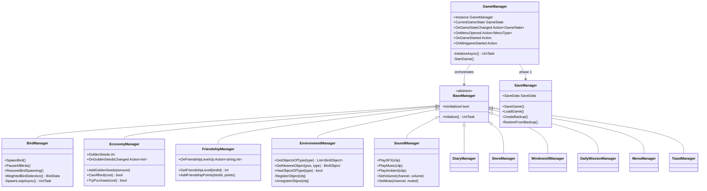

---

## 4. Bird Lifecycle State Machine

Each bird goes through a fixed lifecycle from spawn to destruction. Visiting is the main state where behavior selection happens. All states can transition to Paused during a minigame.

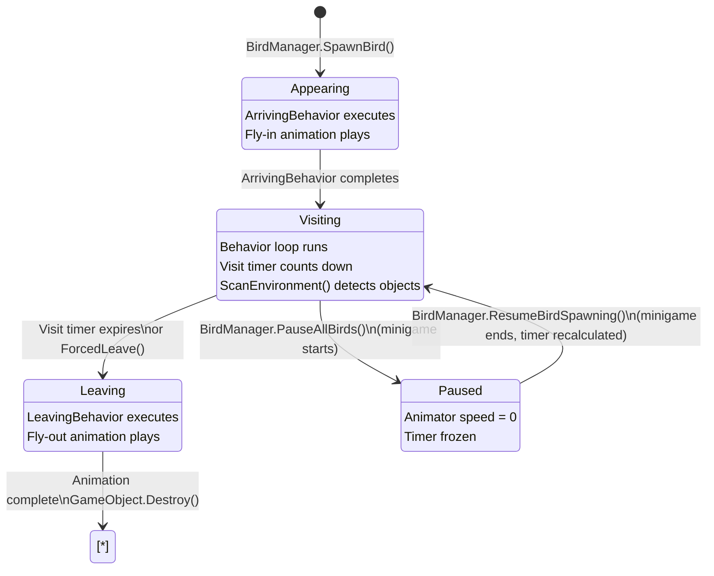

---

## 5. Bird Behavior System

During the Visiting state, the bird cycles through behaviors selected by a weighted random system. Each behavior is a `ScriptableObject` that encapsulates its own logic.

### 5a. Class Structure

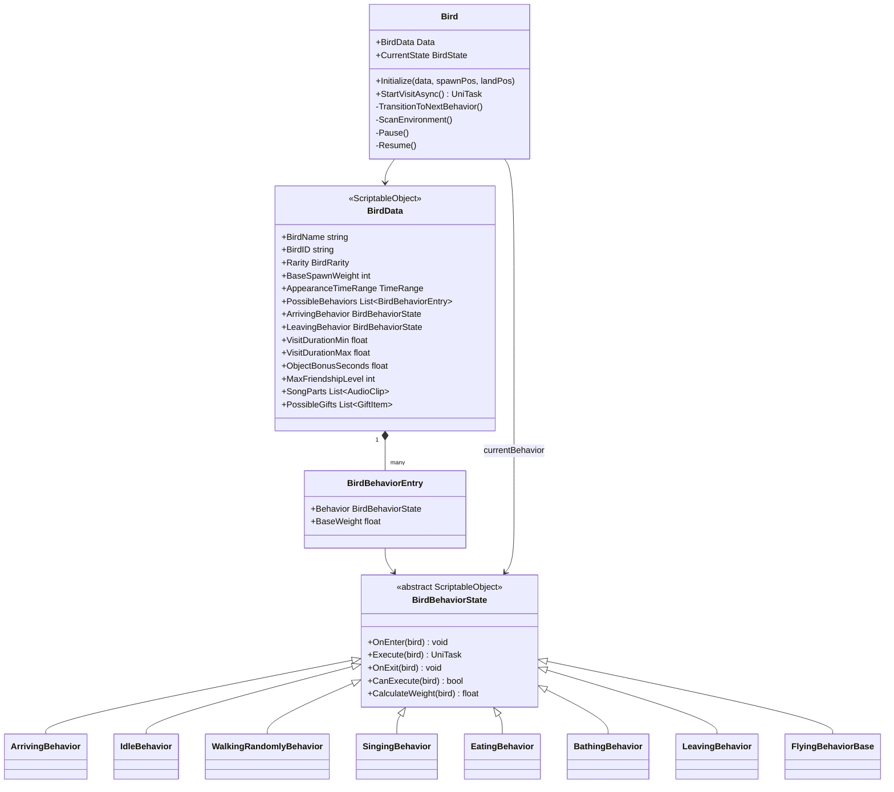

### 5b. Behavior Selection Flow

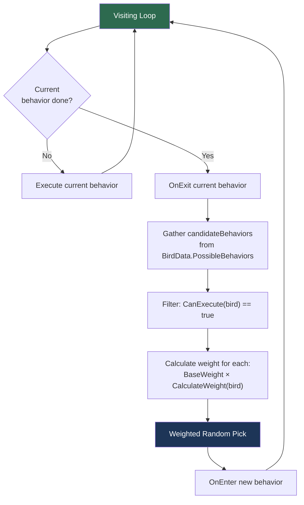

---

## 6. Interactive Objects System

Birds are attracted to interactive objects on the windowsill. Objects auto-register with `EnvironmentManager` and expose interaction positions for behaviors.

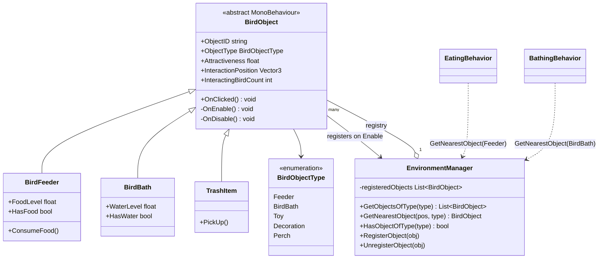

---

## 7. Spawn System & Weighting

`BirdManager` uses a multi-factor weighted selection to determine which bird spawns next.

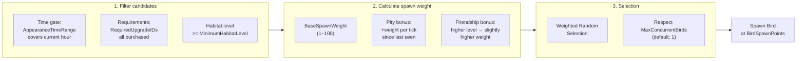

---

## 8. Save Data Model

All game state is serialized to JSON via `SaveManager`. A backup is created before every save.

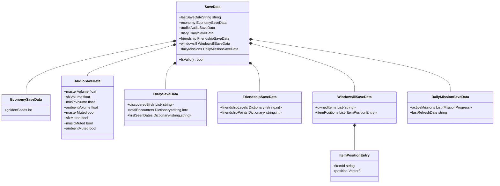

### Save file location

```
%AppData%\..\LocalLow\<Company>\Birdie\
├── save.json
└── save_backup.json   ← created before every write
```

---

## 9. Economy & Progression Flow

The game uses a **dual-resource economy** to separate exploration (Golden Seeds) from emotional attachment (Friendship Points).

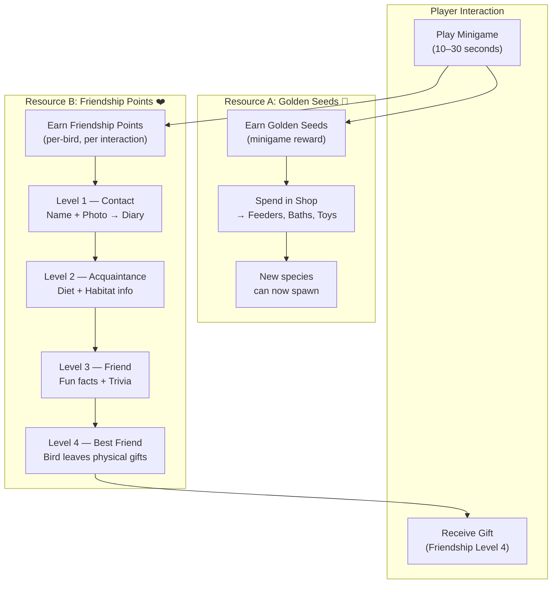

---

## 10. UI & Menu System

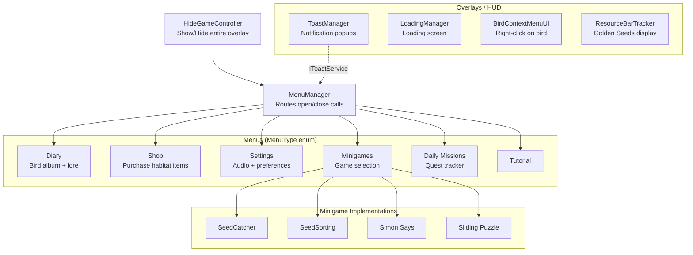

### Minigame Interface

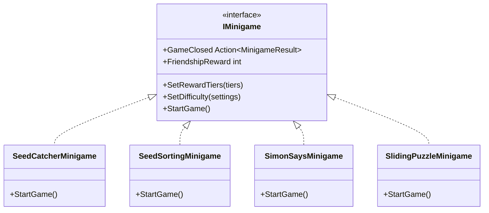

---

## 11. Audio System

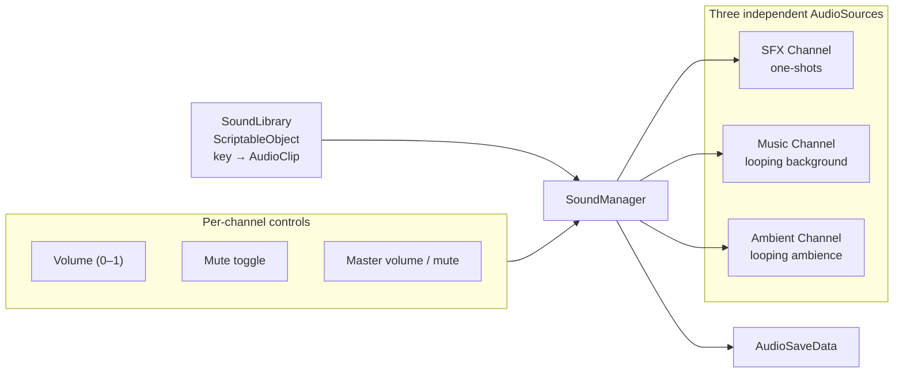

---

## 12. Debug & Logging System

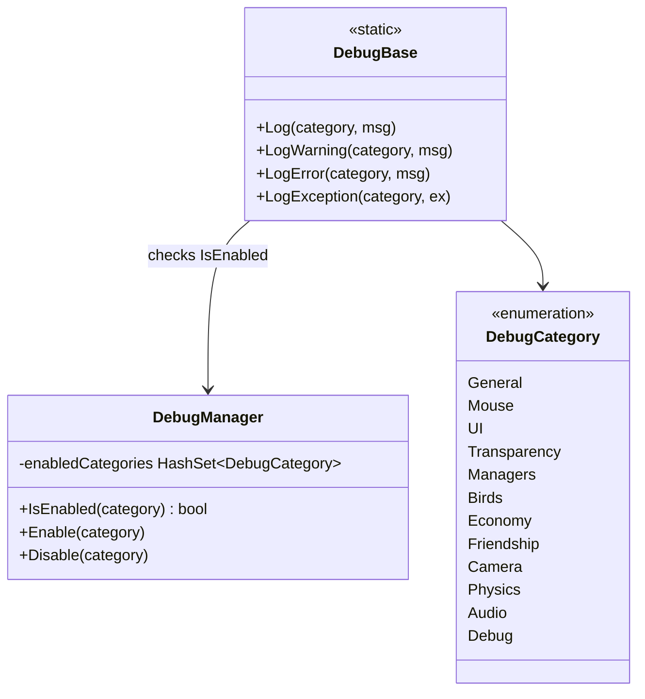

---

## 13. Key Design Decisions

| Decision | Rationale |
|---|---|
| Manager Singleton pattern via `GameManager` | Centralized initialization order, easy cross-system access |
| `BaseManager` abstract class | Uniform `Initialize() UniTask` contract, guarantees async init |
| `BirdBehaviorState` as ScriptableObject | Behaviors configurable per-species in the Unity Editor without code |
| Dual-resource economy | Separates horizontal (new birds) from vertical (deeper bonds) progression |
| JSON + backup save | Simple, human-readable, self-healing on corruption |
| UniTask over Coroutines | Proper async/await, cancellation tokens, no MonoBehaviour dependency |
| `EnvironmentManager` registry | Behaviors discover objects at runtime without hard references |
| `nameof()` in all logs | Refactor-safe — class renames don't silently break log filtering |
